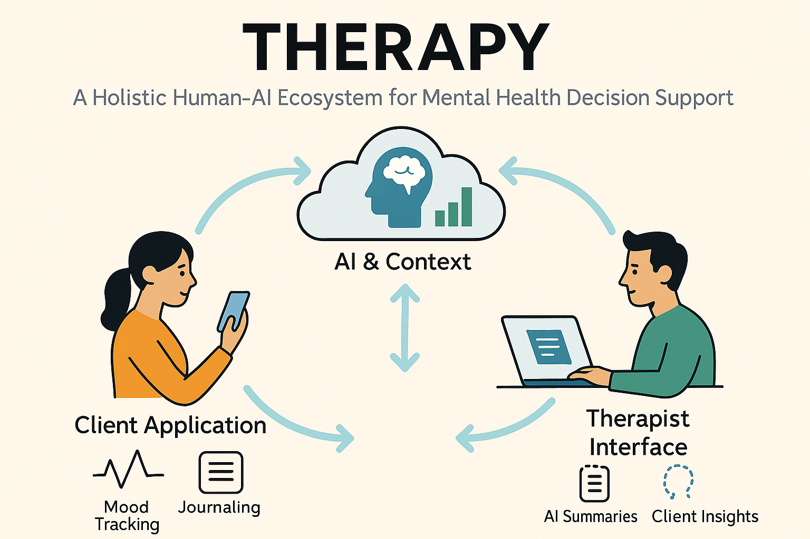

# THERAPY: A Holistic Human-AI Ecosystem for Mental Health Decision Support

**Author:** Alan Szmyt  
**Date:** [Insert Date]  
**Proposal Type:** Informal R&D Proposal  
**Audience:** Mental Health Professionals, Research Sponsors, Policy Stakeholders

---

## 🧠 Executive Summary

This proposal outlines the vision for **THERAPY**, a system designed to augment human mental health care through the integration of **AI-driven summarization**, **biometric context**, and **continuous insight loops** between clients and their therapists. The aim is not to replace therapeutic relationships, but to enhance them—offering clinicians a high-level overview of their client’s emotional and physiological state between sessions.

The project arises from a growing need: suicide rates, substance use (particularly fentanyl-related overdoses), and depression are all rising in parallel. At the same time, therapy remains episodic, often blind to the nuance of what happens between appointments. THERAPY seeks to fill that gap—ethically, collaboratively, and with personalization at its core.

Through data-driven insights, responsible AI, and a feedback-rich interface, this system empowers:
- **Clients** to reflect, learn, and self-regulate.
- **Therapists** to gain deeper awareness and prepare more effectively.
- **Communities** to understand the broader context of suffering and healing.

